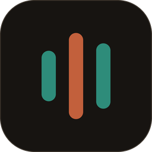
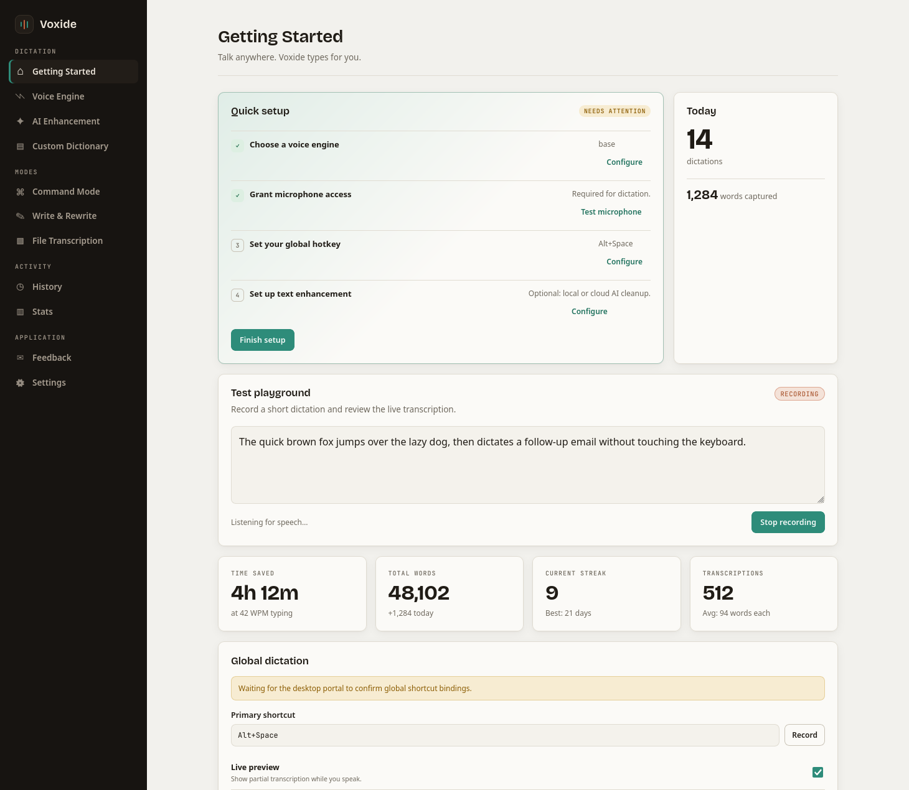

<div align="center">
  
  <h1>Voxide</h1>
  <p><strong>Press a key, talk, and the text lands wherever you were typing.</strong></p>
  <p>
    
    
    
    
  </p>
</div>

Voxide is a cross-platform desktop dictation app. Speech is transcribed locally with Whisper or, in the Linux NVIDIA CUDA build, Parakeet TDT; it can then be optionally cleaned up by an AI provider you configure and inserted directly into the active application.

<picture>
  <source media="(prefers-color-scheme: dark)" srcset="docs/screenshot-dark.png">
  
</picture>

## Features

- **Local-first transcription** — downloadable Whisper models from Tiny to Large v3 Turbo, plus Parakeet TDT 0.6B v3 INT8 on Linux/NVIDIA CUDA builds. No audio leaves your machine unless you opt into a cloud engine. macOS system speech and OpenAI-compatible transcription endpoints are also supported.
- **Global dictation from any app** — press your hotkey, speak, and the result is typed into whatever has focus, without stealing it. Toggle, hold-to-record, and automatic activation modes; a compact overlay shows the live transcription and microphone level while you speak.
- **Conservative live preview** — Whisper CUDA uses beam search over VAD speech spans. Parakeet commits completed VAD phrases and shows only the active phrase as provisional. Both avoid long-pause hallucinations, while the final result finishes the remaining tail.
- **Speech in, speech out — nothing else** — a voice-activity gate rejects silence and noise before decoding, so Whisper's infamous hallucinations ("Thank you for watching!") never reach your text, and noise annotations like `[door slams]` are stripped from what does.
- **AI enhancement (optional)** — post-process transcriptions with any OpenAI-compatible or Anthropic-style provider. Per-mode providers, reusable prompt profiles, per-profile model routing, and per-application prompt overrides.
- **Modes beyond dictation** — *Rewrite* transforms selected text in place, *Command* plans shell actions from speech with review-before-execute for destructive commands, and *File Transcription* handles audio/video files in 20-minute chunks.
- **Custom dictionary** — spoken-phrase corrections, recognition-vocabulary hints for supported engines, and opt-in learning that suggests corrections you make repeatedly.
- **History, stats, and audio archive** — searchable local transcription history with optional audio recordings under a disk budget, streaks, milestones, and time-saved estimates.
- **Local API** — an optional loopback-only HTTP API exposes history, dictionary, post-processing, and transcription endpoints for scripting.
- **Privacy by construction** — everything is stored locally; API keys live in the operating system's secure credential store, never in config files. Diagnostic logs never contain dictation, clipboard, or key content.

## How a dictation flows

```
hotkey ──► capture mic ──► VAD gate ──► Whisper or Parakeet (warm local model) ──► filters ──► typed into your app
                              │
                              └── no speech? nothing is typed, ever
```

The Whisper model stays loaded between dictations, voice-activity detection runs on a normalized probe while the decoder always sees your original audio, and beam-search decoding plus no-speech filtering keep the output faithful to what you actually said.

## Building from source

Prerequisites: [Rust](https://rustup.rs), Node.js, and on Linux the ALSA development package:

| Distribution  | Package         |
| ------------- | --------------- |
| Fedora/RHEL   | `alsa-lib-devel` |
| Debian/Ubuntu | `libasound2-dev` |
| Arch Linux    | `alsa-lib`       |

```sh
npm install
npm exec tauri dev          # run the app for development
npm exec tauri build -- --no-bundle   # standalone release binary
```

> **Note:** a plain `cargo build --release` produces a binary that tries to load the UI from the Vite dev server and shows a connection error — Tauri's `custom-protocol` feature is only enabled by the CLI build. Always build runnable binaries with `npm exec tauri build`.

`npm run build` builds and type-checks the frontend only; `cargo test` (in `src-tauri/`) runs the backend test suite. Neither validates audio or desktop integration — launch the app natively for that.

### GPU transcription (optional, recommended)

Local Whisper transcription runs on the CPU by default. whisper.cpp's GPU backends are exposed as cargo features:

- **`vulkan`** — any GPU vendor. Build-time deps (Fedora names): `vulkan-headers`, `vulkan-loader-devel`, `glslc`.
- **`cuda`** — NVIDIA only, needs the CUDA toolkit at build time. A
  user-local toolkit works; no system-wide CUDA installation is required.

```sh
npm exec tauri build -- --no-bundle --features vulkan
```

For CUDA, point the build at your toolkit. The resulting Linux binary embeds
the toolkit's library directory as its runtime search path, so it can also be
launched from a desktop/compositor keybinding without setting
`LD_LIBRARY_PATH` again:

```sh
export CUDA_HOME="$HOME/.local/share/voxide-cuda/toolkit"
export CUDA_PATH="$CUDA_HOME"
export CUDAToolkit_ROOT="$CUDA_HOME"
export PATH="$CUDA_HOME/bin:$PATH"
export CMAKE_CUDA_ARCHITECTURES=89 # RTX 40-series laptop GPU; choose yours
export CMAKE_CUDA_FLAGS=--allow-unsupported-compiler # needed by CUDA 13 + GCC 16
npm exec tauri build -- --no-bundle --features cuda
```

On hybrid laptops Voxide automatically prefers the discrete GPU over the integrated one; set `VOXIDE_GPU_DEVICE=<n>` to override the choice.

#### Parakeet on Linux/NVIDIA CUDA

The `cuda` feature also enables the local **Parakeet TDT 0.6B v3 INT8** engine. It uses the official sherpa-onnx CUDA 12/cuDNN 9 shared runtime; this is separate from the CUDA toolkit used to compile Whisper. On a Linux x86_64 build host, set it up once without sudo:

```sh
./scripts/setup-parakeet-cuda-runtime.sh
export SHERPA_ONNX_LIB_DIR="$HOME/.local/share/voxide-parakeet/runtime/lib"
export PARAKEET_CUDA_LIB_DIRS="$HOME/.local/share/voxide-parakeet/cuda-libs"
```

Then use the normal CUDA build command above. `PARAKEET_CUDA_LIB_DIRS` is embedded into the Linux binary so compositor keybindings do not need an `LD_LIBRARY_PATH`. In Voxide, select **Parakeet** under **Voice Engine** and download the model (about 500 MB). The model is stored under the app's local data directory, can be removed from the same screen, and is used for dictation, file transcription, and the loopback API.

Parakeet's sherpa-onnx implementation is offline rather than token-streaming. Voxide therefore turns its VAD utterances into live updates: fully separated phrases are final in the preview, and only the active phrase is revised. It is transcribe-only; use Whisper where translation is required.

## Global shortcuts on Wayland

X11-style key grabs cannot observe keys in native Wayland windows, so Voxide binds global shortcuts through the XDG Desktop Portal (`org.freedesktop.portal.GlobalShortcuts`). That requires:

- a portal backend implementing GlobalShortcuts (GNOME, KDE, or Hyprland backends; routing per `*-portals.conf`),
- an installed desktop entry whose basename matches the app id (packaged installs provide one; for `tauri dev` add `~/.local/share/applications/dev.pmdcoutinho.voxide.desktop` pointing at the debug binary),
- user approval in the desktop environment's shortcut dialog the first time shortcuts are bound (and again after shortcut settings change).

Settings → Global dictation shows the current portal binding status. On X11, macOS, and Windows the native global-shortcut path is used instead.

### Compositors without a working portal backend

Some Wayland desktops advertise the portal but cannot complete the grab (for example Niri routes GlobalShortcuts to the GNOME backend, which needs GNOME Shell). On those desktops, bind keys in the compositor configuration to the trigger command instead:

```kdl
// niri config.kdl
binds {
    Mod+Space { spawn "voxide" "--trigger" "dictate"; }
    Mod+Escape { spawn "voxide" "--trigger" "cancel"; }
}
```

Supported trigger actions: `dictate`, `prompt`, `command`, `rewrite`, `cancel`, `paste-last`. The command forwards the action to the running instance over a Unix socket in `$XDG_RUNTIME_DIR` and exits. Each trigger acts as a tap (press+release), so hold-to-record is not available through compositor triggers.

Voxide enforces a single running instance — launching it again focuses the existing window, which also works as a "bring it back from the tray" gesture.

## Microphone selection on Linux

On PipeWire and PulseAudio desktops the microphone picker lists the sound server's actual sources (your headset, the built-in microphone, …) rather than raw ALSA PCM names, and capture is routed to the selected source. This uses `pactl` when available and falls back to ALSA device enumeration otherwise. Selecting a specific microphone also prevents Bluetooth headphones from being forced into their low-quality headset profile when you dictate.

## Linux packaging

`npm exec tauri build` produces deb, rpm, and AppImage bundles. The build host additionally needs development packages whose `.pc` files the bundler queries (Fedora names): `libappindicator-gtk3-devel` and, for the AppImage gtk plugin, `librsvg2-devel`. On distributions whose system libraries carry `.relr.dyn` relocation sections (Fedora 40+, Ubuntu 24.04+), set `NO_STRIP=1` for AppImage bundling because linuxdeploy's bundled `strip` cannot process them.

The generated desktop entry is `Voxide.desktop`; its basename is one of the app ids the Wayland global-shortcuts portal registration probes, so installed bundles keep working global shortcuts on Wayland.

## Feedback

Bugs and feature requests are welcome in the [issue tracker](https://github.com/pmd-coutinho/voxide/issues). The in-app Feedback page opens the same tracker and can copy a debug-information block (version, OS, recent diagnostic log lines — never your dictation content) to paste into an issue.

## Acknowledgments

Voxide is highly inspired by [FluidVoice](https://github.com/altic-dev/FluidVoice), an excellent open-source voice-to-text app for macOS. Voxide started as a cross-platform reimplementation of its feature set in Rust and Tauri, and owes its overall design of dictation modes, formatting behavior, and workflow to that project.
